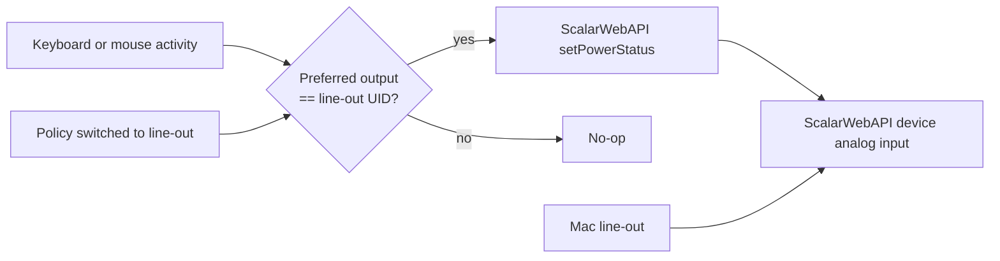
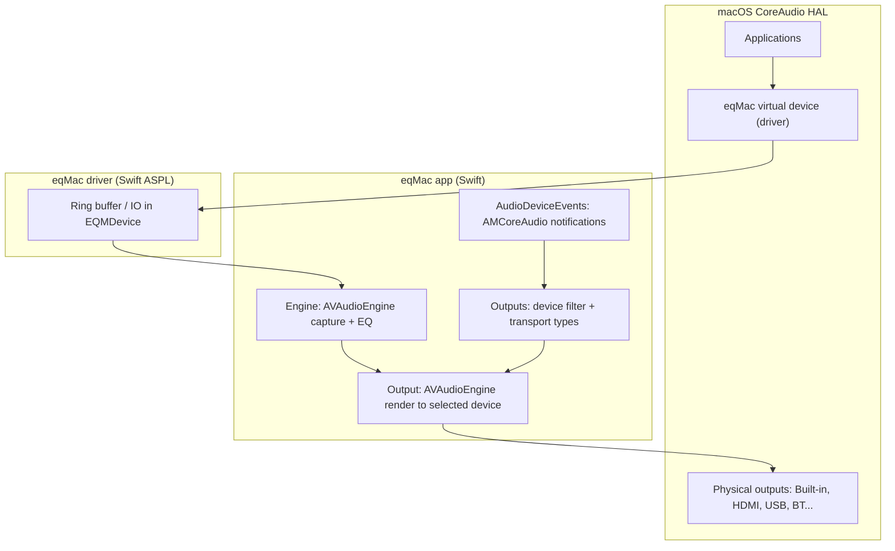
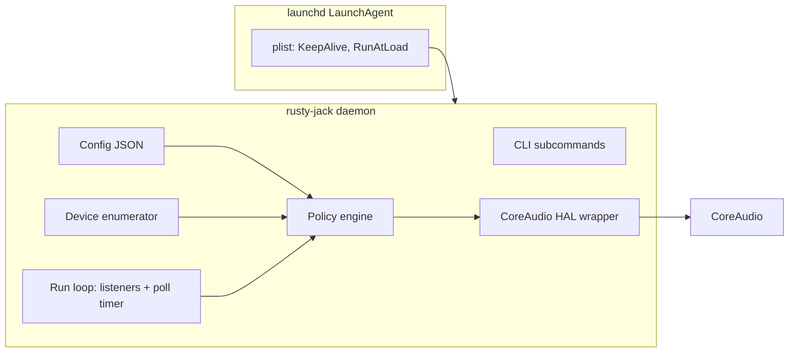

# Rusty Jack — Implementation Plan

**Rusty Jack** is a macOS **command-line audio router** (no GUI) that keeps system audio on a configured **HDMI, DisplayPort, USB-C dock, or line-out** output. It lists outputs, applies JSON routing policy, provides an interactive picker, can run as a launchd-friendly daemon, and can wake configured ScalarWebAPI-compatible devices. For fixed-volume HDMI/DP displays, Rusty Jack currently integrates with **eqMac** as the functional software volume layer when eqMac is already installed. Rusty Jack now packages its own HAL driver with a minimal virtual output device; the passthrough software-volume pipeline remains the next native-driver phase.

This plan is based on investigation of the open-source [eqMac v1.3.2](https://github.com/bitgapp/eqMac) tree (`native/app`, `native/driver`, `native/shared`) and comparable tools ([audio-priority-cli](https://github.com/mateusbadalotti/audio-priority-cli-macos), [audioswitch](https://github.com/retrography/audioswitch)).

---

## Current implementation status

This document mixes shipped architecture and roadmap notes. For the exact user-facing command reference, use [docs/USAGE.md](./docs/USAGE.md).

| Area | Current status |
|------|----------------|
| Device listing and policy status | Implemented: `list`, `list --hdmi`, `status` |
| One-shot routing | Implemented: `apply` with preferred/fallback selection |
| Manual selection | Implemented: `picker`, `picker --index N`, ScalarWebAPI power notes |
| eqMac integration | Implemented: launch only when installed, report app/driver/orphaned-driver state |
| Config volume | Implemented on real switches with retry/readback |
| Daemon | Implemented as a polling loop with config reload and idle-to-active activity sampling |
| LaunchAgent controls | Implemented: `install`, `pause`, `resume`, `disable`, `uninstall`, `upgrade`, status reporting |
| ScalarWebAPI wake | Implemented: SSDP/UPnP discovery, WebSocket/HTTP ScalarWebAPI calls, output-selected and idle-to-active triggers |
| Native HDMI/DP software volume without eqMac | In progress: packaged AudioServerPlugIn with minimal virtual output, stereo stream, and controls; passthrough planned |

---

## 0. Problem statement (why this exists)

### The user-visible bug

When macOS is playing through a **DisplayPort or HDMI monitor** (or many USB-C docks), pressing the **volume keys** (F10 / F11 / F12, Touch Bar, or external keyboard media keys) often **does nothing useful**:

- The on-screen volume overlay may not appear, or
- The slider moves but **audible level does not change**, or
- Volume is stuck at “100%” with no fine control.

Built-in speakers and many Bluetooth/USB headsets expose **software-controllable output volume** in CoreAudio. **External displays frequently do not** — they behave as fixed-gain digital outputs. macOS routes audio directly to them; the system volume control has nothing meaningful to adjust.

### What eqMac actually fixes

eqMac is **not** primarily “pick HDMI instead of built-in.” Its essential trick is:

1. Install a **virtual CoreAudio HAL device** (AudioServerPlugIn driver).
2. Set that virtual device as the **system default output** (what apps and volume keys target).
3. **Capture** system audio in the app, apply **software volume** (and optional EQ), and **re-render** to the real physical device (HDMI/DP/USB).

Volume keys then adjust eqMac’s **software gain** on the virtual device path, which eqMac maps to the physical output — so keyboard volume control works even when the monitor itself is fixed-volume.

### What Rusty Jack aims to do

| Goal | Notes |
|------|--------|
| **Volume keys control audible level on HDMI/DP** | Primary outcome — same class of fix as eqMac |
| **Route to chosen external output** | Required companion: user picks which monitor/dock |
| **Wake ScalarWebAPI devices on user activity** | When line-out is the active/preferred output and daemon idle polling detects the Mac went idle then active, call ScalarWebAPI (`system.setPowerStatus`) to wake a **ScalarWebAPI device** on the LAN — see §1.1 |
| **No GUI, launchd-friendly, JSON config** | Deliberate simplification vs eqMac |
| **No EQ, booster, or per-app mixer in v1** | Out of scope unless explicitly added later |

**Phased delivery:** Enumeration, routing, config migration, daemon polling, LaunchAgent controls, eqMac fallback, native driver lifecycle/package detection, minimal HAL virtual output, and ScalarWebAPI wake support are implemented. The active driver phase adds a **passthrough software-volume pipeline** (eqMac-class architecture, stripped down) so Rusty Jack can provide HDMI/DP volume-key support without eqMac.

---

## 1. Goals and non-goals

### Goals

| Requirement | Approach |
|-------------|----------|
| **Volume keys work on HDMI/DP output** | Today: eqMac integration when already installed. Native path in progress: Rusty Jack virtual HAL device as system default + **software volume** in daemon (eqMac-style passthrough); see §0 and Phase 7 |
| Redirect system sound to HDMI/DP | Set macOS **default output device** via CoreAudio HAL (`kAudioHardwarePropertyDefaultOutputDevice`); virtual device becomes default once driver exists |
| List HDMI outputs | Enumerate output devices; filter by **transport type** and/or UID/name rules |
| launchd integration | Shipped LaunchAgent plist template plus `install`, `pause`, `resume`, `disable`, `uninstall`, `upgrade`, and status reporting |
| Periodic inspection + auto-switch | Shipped polling daemon with config reload; property listeners remain future refinement |
| JSON configuration | `~/.config/rusty-jack/config.json` (path overridable) |
| Homebrew distribution | Implemented through the tap workflow/formula; source install path is `make install` |
| **Clean uninstall** | `rusty-jack uninstall` / `disable` stops the per-user LaunchAgent and removes the plist; config/log purge is future work |
| **Intel + Apple Silicon** | Cross-compile both targets; release **universal** binary + per-arch Homebrew bottles |
| **macOS 12+ (Monterey)** | Minimum deployment target; CoreAudio HAL for routing; virtual driver when volume phase ships |
| Rust + best-practice tooling | `rustfmt`, `clippy` (deny warnings in CI), optional `cargo-deny` / `cargo-audit` |
| **Unit tests per component** | Every module has `#[cfg(test)]` coverage; CI runs `cargo test` on macOS; CoreAudio behind traits for mocks |
| **ScalarWebAPI device wake on user input** | Map Mac **line-out** UID to ScalarWebAPI endpoint; wake on output selection or daemon idle-to-active activity via native Rust ScalarWebAPI client; see §1.1 |

### 1.1 ScalarWebAPI device wake-on-user-activity (implemented with polling)

#### Problem

A Mac’s **headphone / line-out jack** may be cabled to a **ScalarWebAPI device** (or compatible network speaker) analog input. The device often sits in **standby** to save power. When the user returns to the Mac — moves the mouse, clicks, scrolls, or types — audio may be routed to line-out but nothing is audible until someone wakes the device manually (remote or vendor app).

#### Desired behaviour

1. User configures rusty-jack with:
   - **`preferred_device_uid`** (or equivalent) = the Mac **Built-in Output / line-out** CoreAudio device that feeds the ScalarWebAPI device.
   - **`scalar_webapi_device`** block = ScalarWebAPI endpoint + model hint for the ScalarWebAPI device on the LAN.
2. Daemon samples macOS HID idle time and treats idle-to-active transitions as user activity. Native event taps remain a possible refinement.
3. When **both** are true:
   - active or preferred output is the configured line-out UID (or policy has just switched to it), **and**
   - a configured input-activity event occurred (keyboard and/or mouse, per `triggers`),
4. rusty-jack calls the device's **local ScalarWebAPI** (JSON-RPC-style calls over HTTP/WebSocket) to **wake** the unit — implemented **natively in Rust**, without an external protocol client.

#### Reference: ScalarWebAPI (Rust-native client)

rusty-jack speaks ScalarWebAPI directly and does not depend on Python, pip, or an external protocol CLI at runtime.

| Topic | Detail |
|-------|--------|
| Protocol | ScalarWebAPI: JSON-RPC-style calls over WebSocket with HTTP fallback |
| Base URL | Discovered via SSDP/UPnP `X_ScalarWebAPI_BaseURL` when possible; configured `host` / `port` / `path` is fallback |
| Guide endpoint | `{base}/guide` — bootstrap: `getSupportedApiInfo` lists services (`system`, `audio`, `avContent`, …) |
| Service endpoint | `{base}/{service}` after resolving the advertised base URL |
| Request shape | `{"method":"<name>","params":[{...}],"id":<n>,"version":"1.1"}` |
| Method discovery | POST `getMethodTypes` with `params: [""]` on each service URL |
| **Wake** | `system.setPowerStatus` with `params: [{"status":"active"}]` |
| **Status** | `system.getPowerStatus` is used for picker notes and wake messages |
| WebSocket | Implemented for ScalarWebAPI calls, with HTTP POST fallback |
| Power on | The device network standby/wake option must be enabled for network wake from standby; cold power-off may need **Wake-on-LAN** (future; MAC from `getSystemInformation`) |
| Rust deps | `tungstenite` for WebSocket plus standard TCP/UDP networking and `serde_json` |
| Isolation | Unit tests cover parsing, filtering, and formatting; LAN I/O is skipped unless a configured ScalarWebAPI device is actually targeted |

##### ScalarWebAPI call flow (wake)

```text
1. Call {endpoint}/guide
   {"method":"getSupportedApiInfo","params":[{}],"id":1,"version":"1.1"}
   → confirms "system" service exists

2. Call {endpoint}/system
   {"method":"getPowerStatus","params":[{}],"id":2,"version":"1.1"}
   → annotate current state and avoid noisy wake attempts via debounce

3. Call {endpoint}/system
   {"method":"setPowerStatus","params":[{"status":"active"}],"id":3,"version":"1.1"}
   → wake from standby
```

Example (curl):

```bash
curl -s -X POST "http://192.168.1.42:10000/<base-path>/system" \
  -H "Content-Type: application/json" \
  -d '{"method":"setPowerStatus","params":[{"status":"active"}],"id":1,"version":"1.1"}'
```

##### Rust module layout (current)

```text
src/scalar_webapi_device/mod.rs    # discovery, service priming, power status, wake command
src/activity.rs    # macOS HID idle-time sampling abstraction
src/daemon.rs      # scheduled policy ticks and idle-to-active wake trigger
```

**Non-goal:** shipping or invoking Python, pip, or an external protocol CLI.

#### Trigger design (macOS)



**Recommended triggers (configurable):**

| Trigger | Source | Notes |
|---------|--------|-------|
| `keyboard` | Daemon HID idle-time polling | Treated as activity when the Mac transitions from idle to active |
| `mouse` | Daemon HID idle-time polling | Treated as activity when the Mac transitions from idle to active |
| `output_selected` | `apply`, `picker`, or daemon route switch to configured UID | Wake when output switches to line-out even without input yet |
| `debounce` | Timer in daemon | Avoid spamming the device API (e.g. 30–60 s cooldown while already awake) |

**Permissions:** Current idle-time polling does not require Accessibility permission. If a future native event tap is added, it should observe event types only for wake gating — not keystroke logging or screen recording.

#### Configuration sketch (see `config.example.scalar-webapi-device.json`)

```json
"scalar_webapi_device": {
  "enabled": true,
  "model": "ScalarWebAPI device",
  "host": "scalarwebapi-device.local",
  "port": 10000,
  "mac_output": { "name": "External Headphones", "uid": "BuiltInHeadphoneOutputDevice" },
  "triggers": ["keyboard", "mouse", "output_selected"],
  "wake_debounce_ms": 30000,
  "request_timeout_ms": 3000,
  "require_quick_start": true
}
```

- **`host`** — hostname, FQDN, or IP address (e.g. `scalarwebapi-device.local` or `192.168.1.42`); ScalarWebAPI URL is built from `host`, `port`, and the protocol base path.
- **`mac_output`** — same shape as `preferred_device` (`name` plus `uid`) for the Mac line-out feeding the ScalarWebAPI device.
- Omit `scalar_webapi_device` entirely when the feature is not used on this Mac.
- **`request_timeout_ms`** — HTTP timeout for ScalarWebAPI calls.

#### Non-goals for this feature

- Full ScalarWebAPI remote (EQ, multi-room grouping, source switching on the device).
- Replacing the vendor app for everyday control.
- Waking devices when line-out is **not** the active/preferred output.

#### Status

Implemented with daemon idle polling and output-selection hooks. Native event taps and a dedicated `scalar-webapi-device discover` helper remain optional refinements.

### Non-goals (for v1)

- Menu bar / web UI (eqMac’s Angular UI is out of scope)
- System-wide EQ, volume booster, per-app mixer (eqMac Pro features)
- Code signing / notarization automation (document manually; required for wide distribution and **required before virtual driver install** for most users)

### Important scope note vs eqMac

eqMac solves **two** coupled problems:

1. **Volume control** — virtual device intercepts volume keys; app applies software gain before the physical output.
2. **Output selection** — user (or heuristics) picks which physical device receives the re-rendered stream.

Tools like [audio-priority-cli](https://github.com/mateusbadalotti/audio-priority-cli-macos) only solve **(2)** — switching the default output UID. That **does not** restore keyboard volume on fixed-gain HDMI/DP displays.

**Rusty Jack** targets eqMac’s **(1) + (2)** with a CLI-first, no-EQ design:

- **Phases 1–6:** Routing, listing, config, daemon — foundation only.
- **Phase 7+:** Virtual AudioServerPlugIn + passthrough with software volume — **required for the core value proposition.**

We intentionally defer the driver (higher complexity, install/uninstall, signing) but **do not** treat it as optional forever; it is how volume keys get fixed.

---

## 2. eqMac architecture (what we learned)

### 2.1 Component diagram



### 2.2 Relevant eqMac source locations

| Area | Path | Role |
|------|------|------|
| Device filtering | `native/app/Source/Audio/Outputs/Outputs.swift` | `SUPPORTED_TRANSPORT_TYPES` includes `.hdmi`, `.displayPort`, `.thunderbolt`, `.usb`, etc.; excludes driver UID and aggregate devices |
| Auto-select heuristic | `Outputs.shouldAutoSelect` | Auto-picks **bluetooth / built-in** on plug-in — **not** HDMI (HDMI selection is user-driven or UI-driven) |
| Default output change | `Application.startPassthrough` | Sets `AudioDevice.currentOutputDevice = Driver.device!` (virtual), stores real target in `selectedDevice` |
| Physical routing | `Application.createAudioPipeline` | `Output(device: selectedDevice!)` renders processed audio to hardware |
| Hot-plug | `Application.setupDeviceEvents` | `deviceListChanged`, `outputChanged`, `isJackConnectedChanged` |
| CoreAudio helpers | `native/app/Source/Extensions/AudioDevice.swift` | UID lookup, `setAsDefaultOutputDevice()`, volume/balance |
| Virtual driver | `native/driver/Source/EQM*.swift` | AudioServerPlugIn: properties, ring buffer, sample rates |
| UI transport types | `ui/src/app/sections/outputs/outputs.service.ts` | `'hdmi' \| 'displayPort' \| ...` exposed to Angular UI |

### 2.3 eqMac behaviors to copy or improve

**Copy (concepts):**

- **Virtual device as default output** so volume keys target controllable software gain, not the fixed HDMI endpoint.
- Filter devices by `kAudioDevicePropertyTransportType` (HDMI = `'hdmi'`, DisplayPort often carries display audio too).
- Use stable **`kAudioDevicePropertyDeviceUID`** in config (names change; IDs can change across reboots but UIDs are the usual key).
- Listen for `kAudioHardwarePropertyDevices` list changes and `kAudioHardwarePropertyDefaultOutputDevice` changes.
- Exclude virtual/aggregate/driver devices from user-facing lists (eqMac excludes `Constants.DRIVER_DEVICE_UID`, `CADefaultDeviceAggregate`).
- **Software volume / passthrough pipeline** — capture from virtual device, apply gain from system volume property, render to selected physical UID (`Output.swift`, `Engine.swift`).

**Improve (known eqMac pain points):**

- [Issue #829](https://github.com/bitgapp/eqMac/issues/829): auto-switch fails after sleep/clamshell when HDMI was plugged in while lid closed. Mitigate with:
  - **Polling** on interval (configurable) in addition to listeners.
  - **Wake notifications** (`NSWorkspace.didWakeNotification` equivalent — in a CLI daemon, use `IORegisterForSystemPower` or periodic re-enumeration after resume).
  - Optional **delay after device list change** before applying switch (eqMac uses `Async.delay(500)` / `1000` ms in several paths).

---

## 3. Recommended architecture for this project

### 3.1 High-level design



**Single binary**, two modes:

1. **Foreground / one-shot CLI** — `list`, `status`, `apply`, `picker`, `install`, `pause`, `resume`, `uninstall`, `upgrade`, etc.
2. **Daemon mode** — `rusty-jack daemon` (long-running; used by launchd)

**Current:** HAL-only binary enumerates and routes to physical devices, with eqMac as the optional software volume layer. **Future driver work:** daemon also hosts **passthrough + software volume** once the virtual driver is installed; system default becomes the Rusty Jack virtual device.

### 3.2 Crate layout

```
rusty-jack/
├── Cargo.toml
├── rustfmt.toml
├── clippy.toml                    # optional: warn = deny for pedantic subset
├── .github/workflows/ci.yml       # fmt, clippy, test, both targets
├── .github/workflows/release.yml  # aarch64 + x86_64 + universal tarball
├── README.md
├── IMPLEMENTATION_PLAN.md         # this file
├── config.example.json
├── .cargo/config.toml             # MACOSX_DEPLOYMENT_TARGET=12.0
├── scripts/build-universal        # aarch64 + x86_64 → lipo
├── packaging/homebrew/rusty-jack.rb
├── launchd/
│   └── com.example.rusty-jack.plist.template
├── src/
│   ├── main.rs                    # clap entry, subcommands
│   ├── lib.rs
│   ├── config.rs                  # JSON schema + load/save
│   ├── error.rs
│   ├── coreaudio/
│   │   mod.rs
│   │   device.rs                  # enumerate, metadata, transport type
│   │   default_output.rs          # get/set default output + system output
│   │   listener.rs                # property listeners + run loop integration
│   │   sys.rs                     # unsafe FFI wrappers (thin)
│   ├── policy.rs                  # “should switch?” + target selection
│   ├── scalar_webapi_device/mod.rs                    # ScalarWebAPI client and wake commands
│   ├── activity.rs                # HID idle-time activity monitor
│   ├── daemon.rs                  # main loop, poll, wake handling
│   ├── launchd.rs                 # install/pause/resume/uninstall/upgrade LaunchAgent helpers
│   └── cli.rs                     # clap parsing (testable without main)
└── tests/
    ├── cli_integration.rs         # optional: assert_cmd end-to-end
    └── fixtures/                  # JSON configs, plist golden files, device snapshots
```

Each `src/*.rs` and `src/coreaudio/*.rs` module includes a `#[cfg(test)] mod tests { ... }` block (or `tests/<module>_tests.rs` only for cross-module integration). **No component ships without unit tests.**

### 3.3 Dependencies (Rust)

| Crate | Purpose |
|-------|---------|
| `coreaudio-rs` **or** `objc2-core-audio` | CoreAudio HAL bindings (prefer whichever exposes `AudioObjectSetPropertyData` + transport type cleanly) |
| `clap` (derive) | CLI |
| `serde`, `serde_json` | Config |
| `thiserror`, `anyhow` | Errors (`thiserror` in library, `anyhow` in binary) |
| `tracing`, `tracing-subscriber` | Structured logs (JSON or pretty in foreground) |
| `directories` | Default config path under `~/.config` |
| `tungstenite` | ScalarWebAPI WebSocket calls |
| `ctrlc` | Future graceful shutdown in daemon mode |

**Dev-dependencies (tests):**

| Crate | Purpose |
|-------|---------|
| `tempfile` | Isolated config/state/plist paths in unit tests |
| `pretty_assertions` | Readable diffs for policy/plist golden tests |
| `assert_cmd` / `predicates` | Optional CLI integration tests in `tests/` |
| `wiremock` | Future network fixtures if HTTP/WebSocket tests grow |
| `serial_test` | Optional: serialize tests that touch global HAL mocks |

**macOS-only:** gate with `cfg(target_os = "macos")` and fail compile on other targets with a clear message.

### 3.4 CoreAudio operations (implementation detail)

#### Enumerate output devices

1. `AudioObjectGetPropertyData` on `kAudioObjectSystemObject` with `kAudioHardwarePropertyDevices`.
2. For each `AudioDeviceID`, check output capability (`kAudioDevicePropertyStreamConfiguration`, scope output).
3. Read properties:
   - `kAudioDevicePropertyDeviceUID` (CFString → Rust `String`)
   - `kAudioObjectPropertyName`
   - `kAudioDevicePropertyTransportType` (`UInt32` FourCC)
   - `kAudioDevicePropertyDeviceIsAlive`
   - Optional: `kAudioDevicePropertyDataSource` / name for multi-source devices (eqMac uses `sourceName` in JSON)

#### Identify “HDMI outputs”

Default filter (configurable):

| Transport FourCC | Typical hardware |
|----------------|------------------|
| `'hdmi'` | HDMI audio |
| `'dp  '` / displayPort | DisplayPort audio |
| `'thun'` / thunderbolt | Dock / monitor over TB |
| `'usb '` | USB-C docks (optional, often user wants this) |

Also support **explicit UID allowlist** and **name substring** rules in JSON for edge cases (CalDigit, “LG TV”, etc.).

#### Set default output

```text
selector: kAudioHardwarePropertyDefaultOutputDevice
scope:    kAudioObjectPropertyScopeGlobal
element:  kAudioObjectPropertyElementMain  (alias Master on older macOS)
object:   kAudioObjectSystemObject
data:     AudioDeviceID
```

Optionally also set `kAudioHardwarePropertyDefaultSystemOutputDevice` so alert sounds match (eqMac sets both virtual driver paths; for physical-only routing, setting both to the same HDMI device is reasonable).

**macOS 15+:** Apple introduced higher-level `AudioHardwareSystem` APIs in Swift; Rust should stay on HAL C API for broad OS support unless you add a thin Swift shim (not recommended for v1).

#### Event-driven monitoring

Register `AudioObjectAddPropertyListener` on:

- `kAudioHardwarePropertyDevices` (list changes)
- `kAudioHardwarePropertyDefaultOutputDevice` (something else changed output)
- Per-device: `kAudioDevicePropertyDeviceIsAlive` for tracked UIDs

**Run loop requirement:** On macOS 10.6+, set `kAudioHardwarePropertyRunLoop` on the system object to the thread’s `CFRunLoop` (or `NULL` for synchronous delivery on listener thread — eqMac/AMCoreAudio uses Foundation run loop). Daemon thread should call `CFRunLoopRun` or integrate with `core-foundation` crate.

#### Polling fallback

Configurable `poll_interval_ms` (default e.g. `3000`). Each tick:

1. Re-enumerate devices.
2. Run policy: if preferred HDMI is present and default ≠ target, call set default.
3. Log at `debug` when no-op; `info` when switching.

This directly addresses eqMac-style missed events after wake/dock hot-plug.

---

## 4. JSON configuration

**Default path:** `~/.config/rusty-jack/config.json`

### 4.1 Schema (example)

```json
{
  "version": 1,
  "auto_switch": true,
  "poll_interval_ms": 3000,
  "switch_delay_ms": 500,
  "preferred_device": {
    "name": "HDMI",
    "uid": "PASTE-UID-FROM-rusty-jack-list"
  },
  "fallback_uids": [
    "DisplayPort-Secondary-UID"
  ],
  "match": {
    "transport_types": ["hdmi", "displayport", "thunderbolt"],
    "name_contains": [],
    "uid_allowlist": []
  },
  "exclude": {
    "name_contains": ["eqMac", "CADefaultDeviceAggregate"],
    "uid_denylist": []
  },
  "also_set_system_output": true,
  "logging": {
    "level": "info",
    "file": "~/Library/Logs/rusty-jack.log"
  }
}
```

### 4.2 Field semantics

| Field | Description |
|-------|-------------|
| `preferred_device.name` | Human-readable CoreAudio device name from `rusty-jack list` / `status` |
| `preferred_device.uid` | Stable CoreAudio UID used for routing |
| `preferred_device_uid` | **Legacy** — use `preferred_device.uid` instead |
| `fallback_uids` | Ordered list tried when preferred is absent |
| `match.transport_types` | Filter for `list --hdmi-only` and optional auto-discovery |
| `match.uid_allowlist` | If non-empty, **only** these UIDs are candidates for auto-switch |
| `auto_switch` | Master enable for daemon behavior |
| `poll_interval_ms` | Polling interval; `0` disables poll (listeners only — not recommended) |
| `switch_delay_ms` | Debounce after device list change before applying (eqMac uses 500–1000 ms) |
| `also_set_system_output` | Mirror alerts/sound effects device |
| `scalar_webapi_device` | Optional — omit on Macs without a networked ScalarWebAPI device |
| `scalar_webapi_device.enabled` | Master switch for ScalarWebAPI device / ScalarWebAPI wake logic |
| `scalar_webapi_device.host` | Hostname, FQDN, or IP (e.g. `scalarwebapi-device.local`) |
| `scalar_webapi_device.port` / `path` | ScalarWebAPI URL pieces; `path` usually stays omitted so the protocol default is used |
| `scalar_webapi_device.mac_output` | Line-out device selector (`name` plus `uid`) |
| `scalar_webapi_device.triggers` | `keyboard`, `mouse`, `output_selected` (see §1.1) |
| `scalar_webapi_device.wake_debounce_ms` | Minimum interval between wake commands |
| `scalar_webapi_device.request_timeout_ms` | HTTP timeout for ScalarWebAPI POST calls |
| `scalar_webapi_device.require_quick_start` | Documents that the device network standby/wake option should be enabled |

### 4.3 Config discovery

Resolution order:

1. `--config /path/to/config.json`
2. `$HDMI_SOUND_CONTROLLER_CONFIG`
3. `~/.config/rusty-jack/config.json`

Starter configs currently live in `config.example.json` and `config.example.scalar-webapi-device.json`.

---

## 5. Current CLI specification

Binary name: **`rusty-jack`** (crate `rusty-jack`, `RUSTY_JACK_CONFIG` env override).

| Subcommand | Description |
|------------|-------------|
| `apply` | Apply policy once from config |
| `daemon` | Run the long-lived polling supervisor loop |
| `disable` | Stop, disable, and remove the per-user LaunchAgent plist |
| `install` | Render, enable, and bootstrap the per-user LaunchAgent for the current binary |
| `list` | Print output devices (`--hdmi`, `--json`) |
| `pause` | Stop and disable the LaunchAgent while keeping the plist |
| `picker` | Interactive picker or scripted `--index N` route switch |
| `resume` | Re-enable and bootstrap an installed LaunchAgent |
| `status` | Current default output, virtual default info, policy match, and volume |
| `uninstall` | Remove the per-user LaunchAgent plist (same daemon behavior as `disable`) |
| `upgrade` | Rewrite the plist for the current binary path and restart the LaunchAgent |

**Global flags:** `--config PATH`. Subcommands with JSON support expose `--json`.

### Planned CLI helpers

| Planned helper | Purpose |
|----------------|---------|
| LaunchAgent status | Report loaded state without manual `launchctl` commands |
| Config init/validate | Generate starter config and validate config without running policy |
| Full uninstall/purge | Optional config/log removal and audio restore orchestration |

### Example session

```bash
# Discover devices
rusty-jack list --hdmi

# Copy and edit a starter config, then
cp config.example.json ~/.config/rusty-jack/config.json
$EDITOR ~/.config/rusty-jack/config.json

# Test once
rusty-jack apply

# Install the background service
rusty-jack install

# Temporarily stop or resume an installed LaunchAgent
rusty-jack pause
rusty-jack resume

# Remove the installed LaunchAgent plist later
rusty-jack uninstall
```

---

## 6. Platform support (macOS 12+, Intel & ARM)

### Minimum macOS version: **12.0 Monterey**

Target machines include **older Intel Macs** and **Apple Silicon**, e.g. macOS 12.7 on Intel (darwin 21.x). Rationale:

| Factor | Choice |
|--------|--------|
| APIs | `AudioObjectGetPropertyData` / `SetPropertyData` for default output — stable since 10.4; use `kAudioObjectPropertyElementMain` with fallback to `Master` if needed |
| No kernel/driver | Avoids HAL plug-in install complexity and SIP/driver signing on old OS |
| `launchctl bootstrap` | Supported on Monterey; prefer over deprecated `load` |
| Rust | Pin `MACOSX_DEPLOYMENT_TARGET=12.0` in `.cargo/config.toml` and CI |

**Not supported in v1:** macOS 11 and earlier (possible later if demand exists; would require broader QA matrix).

### Architecture matrix

| Artifact | Intel (`x86_64-apple-darwin`) | Apple Silicon (`aarch64-apple-darwin`) |
|----------|-------------------------------|----------------------------------------|
| GitHub Release tarball | `rusty-jack-{version}-x86_64-apple-darwin.tar.gz` | `rusty-jack-{version}-aarch64-apple-darwin.tar.gz` |
| Optional universal | `rusty-jack-{version}-universal-apple-darwin.tar.gz` via `lipo` | Same binary runs native on both with Rosetta **not** required per arch build |
| Homebrew bottle | Built for host arch at install time, or prebuilt bottle per arch | Same |

Rosetta: ship **native** binaries for each arch; do not rely on Rosetta for the daemon.

---

## 7. Cross-compilation and release builds

### Toolchain

```bash
rustup target add aarch64-apple-darwin x86_64-apple-darwin
```

`.cargo/config.toml` (project-wide):

```toml
[env]
MACOSX_DEPLOYMENT_TARGET = "12.0"

[target.aarch64-apple-darwin]
rustflags = ["-C", "link-arg=-mmacosx-version-min=12.0"]

[target.x86_64-apple-darwin]
rustflags = ["-C", "link-arg=-mmacosx-version-min=12.0"]
```

### Local / CI build commands

```bash
export MACOSX_DEPLOYMENT_TARGET=12.0

# Per architecture
cargo build --release --target aarch64-apple-darwin
cargo build --release --target x86_64-apple-darwin

# Universal binary (releases / manual install)
lipo -create \
  target/aarch64-apple-darwin/release/rusty-jack \
  target/x86_64-apple-darwin/release/rusty-jack \
  -output target/release/rusty-jack-universal
```

Provide `scripts/build-universal` that runs both builds, `lipo`, and optional `codesign` (adhoc for local dev).

### CI (GitHub Actions)

`release.yml` matrix on `macos-13` or `macos-14` runner:

1. Install Rust stable + both targets.
2. Build `aarch64-apple-darwin` and `x86_64-apple-darwin` release binaries.
3. Upload arch-specific tarballs + universal asset.
4. Run `cargo test` on host arch (unit tests); tag manual “audio matrix” for hardware.

`ci.yml` on every PR: **`macos-14` runner only** — `fmt`, `clippy`, `test`, and compile both Apple targets (`cargo build --target ...`) to catch cross-compile breakage. No Linux job (project is macOS-only).

### Verify on old hardware

Before each release, smoke-test on at least:

- [ ] macOS 12.x **Intel** (your machine class)
- [ ] macOS 13+ **Apple Silicon**
- [ ] macOS 14+ **Apple Silicon** (optional)

Check: `list`, `apply`, `install`, `pause`, `resume`, `uninstall`, `upgrade`, sleep/wake + HDMI dock.

---

## 8. Packaging roadmap

Rust compiles to a **native Mach-O binary** per architecture (`aarch64-apple-darwin`, `x86_64-apple-darwin`). Homebrew builds or bottles each arch separately; releases may also ship a **universal** tarball for manual install.

Homebrew distribution is not shipped yet. Current local install uses `make install`; LaunchAgent installation is handled by `rusty-jack install`.

### Recommended path

1. **Tap** (`brew tap the-hcma/tap`) with `packaging/homebrew/rusty-jack.rb`.
2. **GitHub Releases** — CI builds release binaries; formula uses `url` + `sha256` or official bottles.
3. **Source formula** (early days) — `depends_on "rust" => :build` + `cargo install` (template in repo).
4. **homebrew-core** (later) — optional; macOS-only tools use `depends_on :macos`.

### User flow

```bash
brew install your/tap/rusty-jack
rusty-jack list --hdmi
cp config.example.json ~/.config/rusty-jack/config.json
rusty-jack install
```

Homebrew puts the binary in `$(brew --prefix)/bin` (Apple Silicon: `/opt/homebrew/bin`). `rusty-jack install` uses `std::env::current_exe()` when writing the LaunchAgent plist.

### Clean uninstall from Homebrew

Once a full uninstall hook exists, the formula should invoke it so no LaunchAgent or state is left behind:

```ruby
def uninstall
  # Non-interactive full cleanup when binary still exists
  safe_system bin/"rusty-jack", "disable", "--json"
end
```

Current `uninstall` / `disable` removes only the per-user plist and leaves config/logs behind. Future purge support can remove config/state/logs explicitly.

Optional: print caveats on `brew install` reminding users to run `rusty-jack install` after install.

### Notarization

Not required for typical Homebrew installs. Notarize only if you also ship a standalone `.dmg` outside Brew.

---

## 9. Clean uninstall (current + design)

Uninstall must leave the Mac in a predictable state — no orphaned launchd job, no stale plists, no silent background process. Current shipped behavior is `rusty-jack uninstall` / `disable`, which stops/disables the per-user job and removes the plist. Config/log purge and audio restore are future design items.

### What gets removed

| Component | `uninstall` / `disable` today | future full uninstall | future purge |
|-----------|-----------------|-----------------------|--------------|
| `launchctl bootout` + stop daemon | yes | yes | yes |
| `~/Library/LaunchAgents/com.*.rusty-jack.plist` | yes | yes | yes |
| `~/.config/rusty-jack/` | no | no | yes |
| `~/.local/state/rusty-jack/` (saved default UID, install metadata) | no | yes | yes |
| `~/Library/Logs/rusty-jack*.log` | no | no | yes |
| Restore previous default output | no | yes (if state exists) | optional (`--no-restore-audio`) |

### State file (for restore)

On **first successful switch** away from the pre-Rusty-Jack default, write once:

`~/.local/state/rusty-jack/pre_install_default.json`

```json
{
  "output_device_uid": "BuiltInSpeakerDeviceUID",
  "saved_at": "2026-05-24T12:00:00Z"
}
```

`uninstall --restore-audio` sets `kAudioHardwarePropertyDefaultOutputDevice` back to that UID if the device still exists; otherwise print a clear warning and list `rusty-jack list`.

### Uninstall algorithm

```text
uninstall(opts):
  1. agent_uninstall()           # bootout, delete plist, SIGTERM if PID known
  2. if opts.restore_audio: restore_from_state()
  3. if opts.purge: remove config, state, logs
     else if not opts.keep_config: remove state only (keep config by default)
  4. print summary of removed paths
```

### Idempotency and errors

- Missing plist → success (already uninstalled).
- `bootout` fails with “not loaded” → treat as success.
- Log failures at `warn` but exit 0 if agent is definitely stopped (user can delete plist manually).

### User-facing messages

End with one line:

`Rusty Jack uninstalled. LaunchAgent removed. Config kept at ~/.config/rusty-jack (use --purge to delete).`

---

## 10. launchd integration

### 10.1 LaunchAgent template

Path: `~/Library/LaunchAgents/com.<reverse-domain>.rusty-jack.plist`

```xml
<?xml version="1.0" encoding="UTF-8"?>
<!DOCTYPE plist PUBLIC "-//Apple//DTD PLIST 1.0//EN" "http://www.apple.com/DTDs/PropertyList-1.0.dtd">
<plist version="1.0">
<dict>
    <key>Label</key>
    <string>com.example.rusty-jack</string>
    <key>ProgramArguments</key>
    <array>
        <string>/opt/homebrew/bin/rusty-jack</string>
        <string>daemon</string>
    </array>
    <key>RunAtLoad</key>
    <true/>
    <key>KeepAlive</key>
    <true/>
    <key>StandardOutPath</key>
    <string>/Users/SHARED/Library/Logs/rusty-jack.stdout.log</string>
    <key>StandardErrorPath</key>
    <string>/Users/SHARED/Library/Logs/rusty-jack.stderr.log</string>
    <key>EnvironmentVariables</key>
    <dict>
        <key>RUST_LOG</key>
        <string>info</string>
    </dict>
</dict>
</plist>
```

Current `install`:

1. Resolve absolute path to the binary (`std::env::current_exe` at install time).
2. Substitute user home for log paths.
3. Run `launchctl bootstrap gui/$(id -u) ~/Library/LaunchAgents/....plist` (macOS 12+).

Current `uninstall` / `disable` runs launchd stop/disable actions and deletes the plist.

### 10.2 Permissions

- **No root required** for LaunchAgent or setting default output to a **physical** device.
- **Root (or admin password) required** to install the virtual HAL plugin in `/Library/Audio/Plug-Ins/HAL/` (Phase 7).
- Volume keys are handled via the **virtual device + software gain** path — no Accessibility permission or key simulation needed.

---

## 11. Policy engine (auto-switch logic)

Pseudocode:

```text
function desired_device(enumerated, config) -> Option<Device>:
    if config.preferred_uid is connected and alive:
        return that device
    for uid in config.fallback_uids:
        if uid connected and alive:
            return that device
    if config.match.uid_allowlist non-empty:
        return first connected device in allowlist
    return first connected device matching transport_types filter

function should_switch(current_default, desired, config) -> bool:
    if not config.auto_switch: return false
    if desired is None: return false
    if current_default.uid == desired.uid: return false
    if user_override_grace_period active: return false  # optional future
    return true
```

**Optional v1.1:** `manual_until` timestamp in config or separate state file when user runs `set` manually (don’t fight user for N minutes).

---

## 12. Rust tooling and quality bar

### 12.1 Formatter and linter

`rustfmt.toml`:

```toml
edition = "2021"
max_width = 100
```

CI:

```bash
cargo fmt --all -- --check
cargo clippy --all-targets --all-features -- -D warnings
cargo test
cargo build --release
cargo build --release --target aarch64-apple-darwin
cargo build --release --target x86_64-apple-darwin
```

### 12.2 Additional checks (recommended)

| Tool | Purpose |
|------|---------|
| `cargo-deny` | License / advisory DB for dependencies |
| `cargo-audit` | Security advisories |
| `cargo-llvm-cov` | Coverage on policy + config parsing |

### 12.3 MSRV and Xcode SDK

- **Rust:** 1.85+ (pin in `rust-toolchain.toml`).
- **macOS deployment target:** 12.0 (`MACOSX_DEPLOYMENT_TARGET`).
- **CI Xcode:** macOS 12 SDK minimum via runner + deployment target flags (build on `macos-13`+ runners for reliable cross-target support).

### 12.4 Unsafe code

Keep FFI in `coreaudio/sys.rs`; document safety invariants for listener callbacks (Send/Sync — listeners run on audio thread; use channel to policy thread).

### 12.5 Unit test policy (required)

1. **One test module per component** — colocated `#[cfg(test)] mod tests` in the same file as the code under test.
2. **No hardware in unit tests** — CoreAudio I/O goes behind traits (`AudioHal`, `DeviceEnumerator`); unit tests use fakes/fixtures.
3. **PR gate** — `cargo test --all-targets` must pass on macOS CI before merge.
4. **Coverage target (soft)** — ≥80% line coverage on `config`, `policy`, `launchd`, `daemon` logic (exclude `coreaudio/sys.rs` FFI glue); track with `cargo llvm-cov`.
5. **Naming** — `test_<function>_<scenario>` (e.g. `test_policy_prefers_hdmi_when_connected`).

---

## 13. Implementation phases

### Phase 0 — Project bootstrap (0.5 day)

- [ ] `cargo init` workspace, CI, `rustfmt` / `clippy`
- [ ] macOS-only `cfg` gates; `MACOSX_DEPLOYMENT_TARGET=12.0` in `.cargo/config.toml`
- [ ] `tracing` setup
- [ ] `release.yml`: build `aarch64-apple-darwin` + `x86_64-apple-darwin` on every tag
- [ ] **Tests:** `error.rs` unit tests; `cli.rs` parse tests for all subcommands; CI runs `cargo test`

### Phase 1 — CoreAudio read path (1–2 days)

- [ ] `AudioHal` trait + `CoreAudioHal` impl + `MockHal` for tests
- [ ] Enumerate output devices (UID, name, transport, alive)
- [x] `list` and `status` subcommands
- [ ] **Tests:** `coreaudio/device.rs` — filter HDMI, exclude aggregates, empty list; `default_output.rs` — get default from mock; parse transport FourCC

### Phase 2 — Write path (1 day)

- [x] `apply` — set default output (+ optional system output)
- [x] Manual hardware smoke test (not unit tests)
- [x] **Tests:** CoreAudio/default-output and mock HAL coverage for set default behavior

### Phase 3 — Config + policy (1 day)

- [x] JSON config load/validate
- [ ] `config init` / `config validate` helpers
- [x] Policy engine + `apply` respects `preferred_device`, legacy `preferred_device_uid`, and fallbacks
- [x] **Tests:** `config.rs`, `policy.rs`, command smoke tests

### Phase 4 — Daemon + listeners + poll (2–3 days)

- [ ] Property listeners + run loop thread
- [x] Poll timer with `poll_interval_ms`, `switch_delay_ms`, and config reload
- [x] `daemon` subcommand
- [x] Idle-to-active activity sampling for ScalarWebAPI wake triggers
- [x] **Tests:** `daemon.rs` tick behavior, no-op suppression, activity transition, cooldown

### Phase 5 — launchd + uninstall (1 day)

- [x] Plist template + `install` / `pause` / `resume` / `disable` / `uninstall` / `upgrade`
- [ ] LaunchAgent status helper
- [ ] Full purge flow for config/log removal
- [ ] State file `pre_install_default.json` on first switch
- [ ] Homebrew formula lifecycle hooks
- [x] README/usage/troubleshooting: install / uninstall / upgrade flow
- [x] **Tests:** `launchd.rs` path/result serialization and command wrappers

### Phase 6 — Hardening (1–2 days)

- [x] Edge cases: device unplugged, aggregates, virtual non-speaker outputs
- [ ] QA matrix: macOS 12 Intel, macOS 13+ ARM
- [x] `scripts/build-universal` + release target
- [x] **Tests:** unit coverage and `assert_cmd` CLI help tests

**Milestone after Phase 6:** Reliable **routing** to HDMI/DP — useful for testing and scripts, but **volume keys still broken** on typical external displays until Phase 7.

### Phase 7 — Virtual driver + software volume (core value) (2–4 weeks)

Delivers the eqMac-class fix for keyboard volume on HDMI/DP:

- [x] **AudioServerPlugIn** virtual output device skeleton with stereo stream and basic volume/mute controls
- [x] `driver install` / `driver uninstall` lifecycle via `rusty-jack install`, `upgrade`, and `uninstall`
- [x] Daemon **passthrough loop**: capture on virtual `WriteMix` ring, apply **software volume**, render to configured physical UID via CoreAudio IO proc
- [x] Set virtual device as **default output** + **default system output** when driver is active and passthrough is armed
- [ ] `uninstall` removes driver and restores prior physical default
- [ ] **Tests:** ring-buffer / gain math unit tests; mock render path; driver property handlers where testable off-hardware

**Definition of done (Phase 7):** User selects HDMI/DP monitor; **F10/F11/F12 change audible volume**; `rusty-jack list` shows virtual + physical devices; clean uninstall restores pre-install audio stack.

### ScalarWebAPI device wake on user input activity (implemented; refinements remain)

Wake a **ScalarWebAPI device** when Mac **line-out** is the target output and the user shows **presence at the Mac** (mouse or keyboard activity). **Native Rust ScalarWebAPI client** — no Python.

- [x] Config block `scalar_webapi_device` (§4.1) + validation
- [x] SSDP/UPnP endpoint discovery and configured endpoint fallback
- [x] WebSocket ScalarWebAPI calls with HTTP POST fallback
- [x] `getPowerStatus`, `setPowerStatus(status: active)`, service priming
- [x] Picker power-state notes for configured ScalarWebAPI output
- [x] Hook into `apply`, `picker`, and daemon output-selected flow
- [x] Idle-to-active daemon trigger with `wake_debounce_ms`
- [x] **Tests:** parsing, endpoint construction, trigger matching, selection filtering, wake message formatting
- [ ] Native event tap refinement for lower-latency keyboard/mouse event detection
- [ ] Optional `rusty-jack scalar-webapi-device discover` helper

**Current definition of done:** Line-out configured as preferred; daemon observes idle-to-active transition while ScalarWebAPI device is in standby → Rust client calls `setPowerStatus` → device wakes; no Python installed; no wake when output is not the configured ScalarWebAPI output; network standby/wake documented.

**Future:** Wake-on-LAN from `getSystemInformation` MAC; input select on ScalarWebAPI device if needed; native event tap if idle polling proves too coarse.

**Remaining estimate:** LaunchAgent helpers and packaging are small follow-up work; native virtual driver remains the largest remaining feature.

**Definition of done (every phase):** feature code + unit tests for touched modules + green `cargo test`.

---

## 14. Future extensions (beyond core volume + routing)

| Feature | Complexity | Approach |
|---------|------------|----------|
| Native event tap activity monitor | **Medium** | Optional refinement over the current daemon idle polling trigger |
| EQ / “bass boost” | **Medium** | Extend passthrough pipeline (Phase 7) with DSP — eqMac uses `AVAudioEngine` for this |
| Per-app routing | **High** | Prism-style virtual bus or Background Music fork |
| Notarization / automated driver signing | **Medium** | Required for wide distribution of the virtual driver outside Homebrew |

For **HDMI/DP volume control (the core problem), Phase 7 is required** — see §0.

---

## 15. Testing strategy

### 15.1 Test pyramid

| Layer | Scope | Runs in CI |
|-------|--------|------------|
| **Unit** | Every component (table below) | yes (`cargo test`) |
| **Integration** | CLI via `assert_cmd`, fixture configs | yes (macOS runner) |
| **Manual / hardware** | Real HDMI, sleep/wake, dock | no (release checklist) |

### 15.2 Unit tests per component (required)

| Component | Test file | What to test |
|-----------|-----------|--------------|
| **`config`** | `config.rs` `mod tests` | Deserialize/serialize round-trip; defaults; invalid `version`; unknown fields denied or ignored per policy; `config_path()` resolution with env override |
| **`error`** | `error.rs` `mod tests` | Display messages; `From` conversions; error codes map to exit status |
| **`cli`** | `cli.rs` `mod tests` | Every subcommand parses; global flags; `--json`; invalid args fail with usage |
| **`policy`** | `policy.rs` `mod tests` | `desired_device()`: preferred connected/disconnected, fallback order, allowlist, transport filter; `should_switch()`: already on target, `auto_switch` off, debounce flag |
| **`daemon`** | `daemon.rs` `mod tests` | One poll cycle applies policy; debounce suppresses rapid switches; shutdown signal stops loop; wake burst schedules extra polls (mock scheduler) |
| **`launchd`** | `launchd.rs` `mod tests` | Plist XML matches golden snapshot; label derived from bundle id; install writes correct paths; uninstall removes plist when missing job; `agent status` parses launchctl output (fixture stdout) |
| **`coreaudio::device`** | `device.rs` `mod tests` | Map mock device list → `OutputDevice`; HDMI filter; exclude denylist names; `is_output_device` heuristic |
| **`coreaudio::default_output`** | `default_output.rs` `mod tests` | Get/set via `MockHal`; `also_set_system_output`; restore UID from state file |
| **`coreaudio::listener`** | `listener.rs` `mod tests` | Property address construction; listener register/unregister; events forwarded on mock HAL (no real `CFRunLoop`) |
| **`coreaudio::sys`** | `sys.rs` | Minimal: FourCC encode/decode helpers only — **no live HAL calls** in unit tests |
| **`main`** | — | Thin; coverage via `cli` + integration tests only |

### 15.3 Test doubles (shared)

```rust
// src/coreaudio/traits.rs (or src/traits.rs)

pub trait AudioHal: Send + Sync {
    fn output_devices(&self) -> Result<Vec<OutputDevice>>;
    fn default_output_uid(&self) -> Result<Option<String>>;
    fn set_default_output(&self, uid: &str) -> Result<()>;
}

pub struct MockHal { /* Vec<OutputDevice>, call log */ }
```

Use **`tests/fixtures/devices.json`** for policy/daemon table tests and **`tests/fixtures/launchagent.golden.plist`** for launchd.

Example policy table test:

```rust
#[test]
fn test_policy_prefers_connected_hdmi_over_builtin() {
    let cfg = fixture_config();
    let devices = fixture_devices_hdmi_and_builtin();
    let hal = MockHal::new(devices).with_default("builtin-uid");
    assert_eq!(policy::desired_device(&cfg, &hal).unwrap().uid, "hdmi-uid");
}
```

### 15.4 CI test job

```yaml
# .github/workflows/ci.yml (excerpt)
- run: cargo test --all-targets --all-features
- run: cargo llvm-cov --all-features --lcov --output-path lcov.info  # optional
```

Run on **`macos-13` or `macos-14` only** — rusty-jack targets macOS CoreAudio and does not support Linux CI runners.

### 15.5 Manual / hardware matrix (not unit tests)

| Scenario | Method |
|----------|--------|
| **Volume keys on HDMI/DP** | Phase 7: F10/F11/F12 change audible level with virtual driver installed |
| **ScalarWebAPI device wake on line-out** | line-out preferred + daemon idle-to-active activity -> Rust `setPowerStatus`; network standby/wake enabled |
| Built-in ↔ HDMI | `apply`, `picker`, `daemon` |
| Sleep/wake + dock | daemon poll after wake |
| Uninstall | `uninstall` / `disable` — no orphan plist |
| Cross-arch | x86_64 on Intel 12.x; arm64 on M-series |

Record device UIDs from `list --json` into `tests/fixtures/` when adding regression cases.

---

## 16. Risks and mitigations

| Risk | Mitigation |
|------|------------|
| **Volume keys have no effect on HDMI/DP** | Phase 7: virtual device as default + software volume passthrough |
| CoreAudio doesn’t switch until run loop / delay | Use `switch_delay_ms`; call `CFRunLoopRunInMode` briefly after set |
| HDMI connected while asleep (eqMac #829) | Polling + post-wake burst enumeration |
| Bluetooth HFP devices can’t be default output | Exclude by transport; document limitation |
| Device UID changes after firmware update | Support `name_contains` + `list` to update config |
| User fights daemon with Sound settings | Optional manual grace period; log when overriding |
| `coreaudio-rs` API gaps for set-default | Thin `unsafe` module using `AudioObjectSetPropertyData` directly |
| Cross-compile link errors on CI | Pin deployment target; install both rustup targets; compile both in CI |
| Uninstall leaves audio on HDMI | Default `--restore-audio`; document `--no-restore-audio` for Brew |
| macOS 12 API drift | Test on darwin 21.x hardware; avoid macOS 15-only Swift APIs |
| **ScalarWebAPI device stays asleep on line-out** | ScalarWebAPI wake when configured Mac output is active and `output_selected` or idle-to-active trigger fires |
| ScalarWebAPI wake fails (ScalarWebAPI device asleep) | Enable **network standby/wake** on the device; verify endpoint with `picker` power notes or curl; debounce + log failures |
| Input activity polling is too coarse | Add native event tap refinement later; `output_selected` trigger works today |

---

## 17. References

- eqMac README (driver + app split): https://github.com/bitgapp/eqMac/blob/master/README.md
- eqMac outputs filter: `native/app/Source/Audio/Outputs/Outputs.swift`
- eqMac passthrough / selection: `native/app/Source/Application.swift`
- eqMac virtual driver: `native/driver/Source/EQMDevice.swift`, `EQMInterface.swift`
- Apple AudioServerPlugIn: https://developer.apple.com/documentation/coreaudio/creating_an_audio_server_driver_plug-in
- `coreaudio-rs` macOS helpers: https://docs.rs/coreaudio-rs/latest/coreaudio/audio_unit/macos_helpers/
- Similar CLI (priority list): https://github.com/mateusbadalotti/audio-priority-cli-macos
- audioswitch (C reference for set/get default): https://github.com/retrography/audioswitch/blob/master/device.c

---

## 18. Decision log (recommended defaults)

1. **The core problem is software volume on HDMI/DP** — routing-only tools cannot solve it; a virtual device is required.
2. **No virtual driver in Phases 1–6** — routing foundation ships first; **Phases 1–6 alone do not fix volume keys**.
3. **UID-based config** — not eqMac’s numeric `AudioDeviceID` (session-unstable).
4. **Listeners + poll** — don’t rely on listeners alone (eqMac wake bugs).
5. **LaunchAgent not LaunchDaemon** — per-user audio context; no root for the agent itself (but root **is** required to install a HAL plugin).
6. **`clippy -D warnings`** — keep codebase clean from day one.
7. **macOS 12.0 minimum** — supports older Intel Macs (e.g. Monterey 12.7); no macOS 11 in v1.
8. **Dual-target releases** — always ship `aarch64` + `x86_64` artifacts; optional universal via `lipo`.
9. **Clean uninstall is first-class** — current `uninstall` / `disable` removes the per-user LaunchAgent plist; future purge/audio-restore helpers can build on this.
10. **Unit tests per component** — no module merges without colocated tests; CoreAudio behind `AudioHal` mock.
11. **ScalarWebAPI device wake is config-driven** — map line-out UID → ScalarWebAPI endpoint; wake on output selection or daemon idle-to-active activity via native Rust ScalarWebAPI calls (`system.setPowerStatus`).

---

*Document version: 1.9 — current routing daemon, eqMac fallback, LaunchAgent controls, ScalarWebAPI wake support, and packaged HAL virtual output; native HDMI/DP passthrough remains future work.*

Copyright (c) 2026 Henrique Andrade / thehcma.
